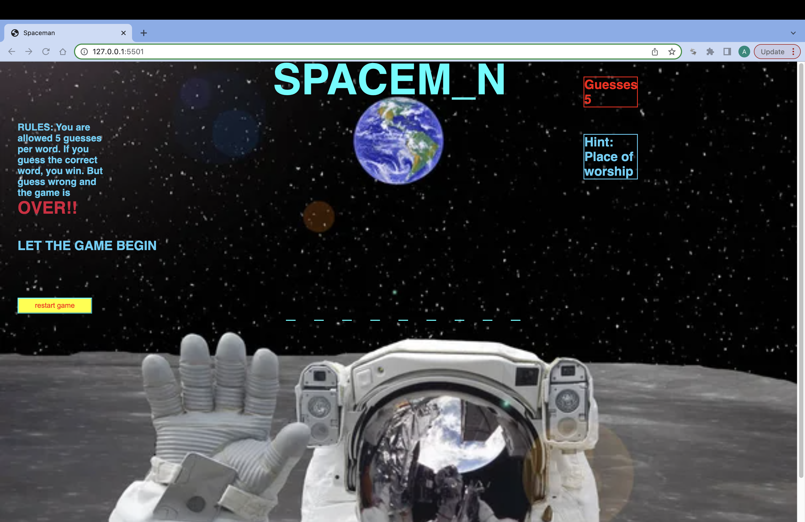

# Spaceman
Spaceman is a guessing game around a word the player is trying to figure out. The player will guess one letter at a time with only 5 guesses. The player will be given 5 guesses but will only be penalized for wrong guesses.If the player can figure outh the word before their guesses go out, they win. But if not, they lose.

# Images

# Technoligies used
JavaScript
CSS
HTML

# Getting Started
https://github.com/Akil92/spaceman.git

# Next Steps
Some future enhancements would be to show the letters that the player has already guessed and also to add categories.